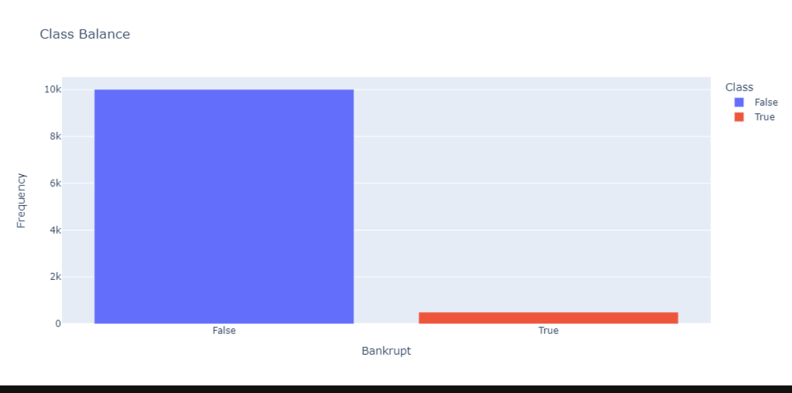
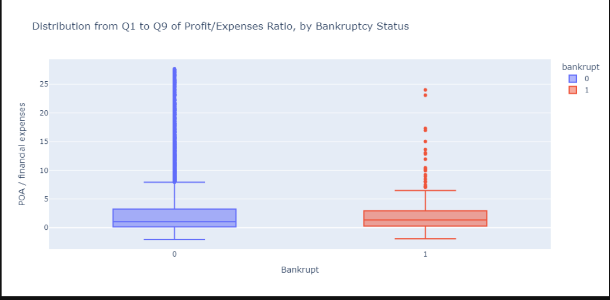
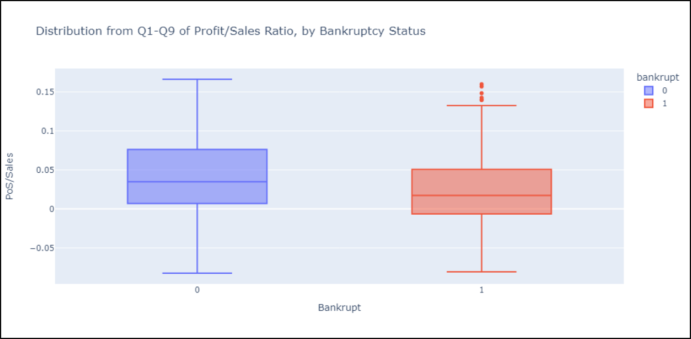
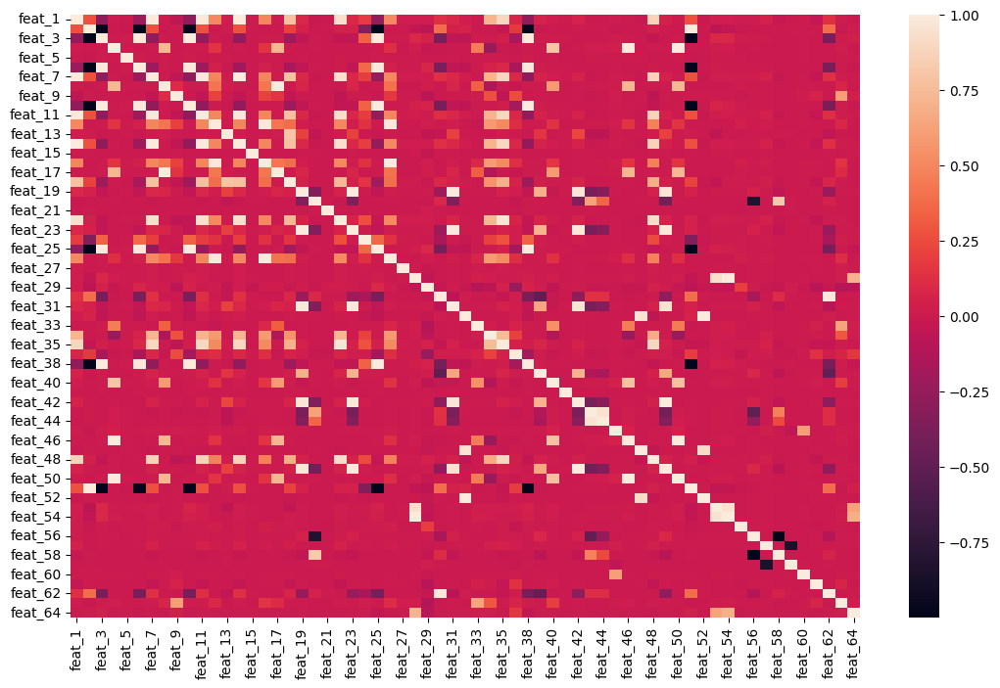
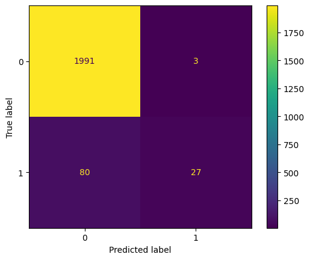

# Poland-Bankruptcy
According to company data provided by [UCI university](https://archive.ics.uci.edu/ml/datasets/Polish+companies+bankruptcy+data), Use the classification model to predict whether a company is able to be bankrupted

## Reference:
My Project is built according to the project of [WorldQuant University](https://www.wqu.edu/programs/mscfe/?utm_source=Google&utm_medium=RSA&utm_campaign=SA&utm_term=BKW&utm_content=MScFE+US&gclid=CjwKCAjwitShBhA6EiwAq3RqAwtCSVWtPzQmw6PLHf_jWredw0dRew46J_zkxTPMhGpBeV3D9jcjMhoC0_QQAvD_BwE) which is the great place to learn and dive deep the data science and machine learning

## Requirement:
- Python 3.9
- Machine Learning: Sklearn and imblearn
- Analysis: Pandas and Numpy
- Visualization: Matplotlib.pyplot, Seaborn and plotly.express
- Packing Model: pickle

## Overview:
The dataset is about bankruptcy prediction of Polish companies. The data was collected from Emerging Markets Information Service, which is a database containing information on emerging markets around the world. The bankrupt companies were analyzed in *the period 2000-2012*, while the still operating companies were evaluated from *2007 to 2013*.

About the attribute information, please refer to [data dictionary.ipynb](https://github.com/Trihamhochoi/Poland-Bankruptcy/blob/main/data_dictionary.ipynb)
## Introduction:
My model is divided into two parts: [EDA](https://github.com/Trihamhochoi/Poland-Bankruptcy/blob/main/EDA.ipynb) and [the classification](https://github.com/Trihamhochoi/Poland-Bankruptcy/blob/main/Classification_Decision_tree.ipynb) by 2 models (Random Forest and Gradient Booster).

Simultaneously, I will compare the performance and running time of  2 models and select the appropriate model.In addition, I will validate the model using the confusion report to tune tune hyperparameters effectively.

## How to use my code:
You can use my code to create your personal model as well as improve it more professionally. Such as:
- If you have data of other countries, you could try to personalize it and predict the results.
- Or you could build a dasboard to visualize some metrics.

## Machine Learning algorithms:
- [Decision Tree](https://en.wikipedia.org/wiki/Decision_tree)
- [Gradient booster](https://en.wikipedia.org/wiki/Gradient_boosting)

**My Conclusion:** 
In my case, after using cross validation for both algorithsms, I see Random Forest not only saves slightly more time but also gives better score than the other.   
For this reason, we recommend to use Randomforest for this model.
 
## PART1: Exploratory Data Analysis:

### Imbalanced data


From the visualization, in three-year period, the financial situation performed effectively in Poland. However,it also shows us that we have an imbalanced dataset, where our majority class (0) is far bigger than our minority class (1).

Let combine some particular features to have a view genarally about the Labels:

**Feat_27: profit on operating activities / financial expenses**



_Summary statistics:_

| Statistics metric | information |
| ------------------| ----------- |
|count              |    9,788.00 |
|mean               |    1,185.95 |
|std                |   34,691.23 |
|min                | -190,130.00 |
|25%                |        0.00 |
|50%                |        1.07 |
|75%                |        4.81 |
|max                |2,723,000.00 |

Note that the median is around 1, but the mean is over 1000. That suggests that this feature is skewed to the right.
There are so many outliers. Since this historgram is showing a big skewness for this feature.

`More context on "feat_27":`

Profit on operating activities is profit that a company makes through its "normal" operations. For instance, a car company profits from the sale of its cars. 

However, a company may have other forms of profit, such as financial investments. So a company's total profit may be positive even when its profit on operating activities is negative.

Financial expenses include things like interest due on loans, and does not include "normal" expenses (like the money that a car company spends on raw materials to manufacture cars). 

**Feat_39: Profit/Sales Ratio**



Looking at other features, we can see that they're skewed, too. This will be important to keep in mind when we decide what type of model we want to use.

###  The multicollinearity



**Summary:**

Our data is imbalanced. This is something we need to address in our data preparation.

Many features have missing values that we'll need to impute. And since the features are highly skewed, the best imputation strategy is likely median, not mean.

There are multicollinearity issues among features, which means that we should steer clear of linear models, and try a tree-based model (Decision tree) instead.

## PART2: Build model:
- Using RandomOverSampler to revolve the imbalanced problem
- Creating Pipeline: RandomForest vs Gradient Booster to compare and pick up which model is more suitable.
- Tuning the parameter and running cross-validation in order to get the best score 
- Executing a confusion matrix to see how our model performs.



This matrix is a great reminder of how imbalanced our data is, and of why accuracy isn't always the best metric for judging whether or not a model is giving us what we want.

The accuracy score will be amazing, but it won't tell us what we really need to know.

Instead, we can evaluate our model using two new metrics: **precision** and **recall**:
- The precision score is important when we want our model to only predict that a company will go bankrupt if its very confident in its prediction.
- The recall score is important if we want to make sure to identify all the companies that will go bankrupt, even if that means being incorrect sometimes.

```
         label  precision    recall  f1-score   support

           0       0.96      1.00      0.98      1994
           1       0.90      0.25      0.39       107

    accuracy                           0.96      2101
   macro avg       0.93      0.63      0.69      2101
weighted avg       0.96      0.96      0.95      2101
```

For further infomation, you can access my file to explore more innteresting things. :smiling_face_with_three_hearts:
